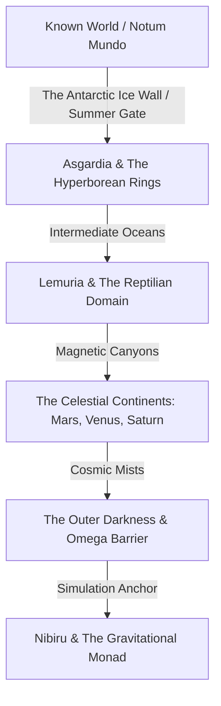

# 🧭 The Flat Faerûn Project

Welcome to **The Flat Faerûn Project**, a conspiratorial, steampunk, and high-fantasy campaign setting for **D&D 5e**. Set in an alternate **1830 AD**, this world explores the boundless possibilities of an Infinite Earth composed of vast concentric rings, ancient gods, clockwork conspiracies, and cosmic observers.

---

## 📖 Introduction: The Great Expedition

The year is 1830. The Napoleonic Wars did not end with a whimper, but with a revelation. A secret cartographer for the Crown discovered that the Earth does not end at the poles. The ice is merely a barrier—a **"Summer Gate"** to vast habitable continents beyond the known horizon.

In this campaign, players embark as members of **"The Flight of the Eagle"**, a secret international expedition aboard the experimental steam-airship *Aetherius*. Their mission: cross the Antarctic Ice Wall through one of its four perilous passages—**"The Sentinel's Gate"**, **"The Serpent's Gate"**, **"The Leviathan's Gate"**, or **"The Tiger's Gate"**—map the Unknown World (*Ignotum Mundo*), and secure its mystical resources before rival factions or the enigmatic **"Round Earth Cult"** can sabotage the journey.

---

## 📁 Repository Structure

*   **[`/English`](file:///c:/Users/ericpapais/source/repos/DeD_Complotti/English)**: Primary campaign documents in English.
    *   [**`Story_Bible.md`**](file:///c:/Users/ericpapais/source/repos/DeD_Complotti/English/Story_Bible.md): The campaign setting guide, detailing 29 chapters of rich lore, regions, factions, and story hooks.
    *   [**`Monster_Manual.md`**](file:///c:/Users/ericpapais/source/repos/DeD_Complotti/English/Monster_Manual.md): Custom bestiary featuring ready-to-use D&D 5e stat blocks for every region.
    *   [**`Items_and_Materials.md`**](file:///c:/Users/ericpapais/source/repos/DeD_Complotti/English/Items_and_Materials.md): Reference guide for special steampunk gear, metals, and magic items.
*   **[`/Italian`](file:///c:/Users/ericpapais/source/repos/DeD_Complotti/Italian)**: Original campaign documents in Italian.
    *   [**`Story_Bible.md`**](file:///c:/Users/ericpapais/source/repos/DeD_Complotti/Italian/Story_Bible.md): La guida ufficiale della campagna in italiano.
    *   [**`Monster_Manual.md`**](file:///c:/Users/ericpapais/source/repos/DeD_Complotti/Italian/Monster_Manual.md): Il bestiario completo con schede statistiche in italiano.
    *   [**`Oggetti_e_Materiali.md`**](file:///c:/Users/ericpapais/source/repos/DeD_Complotti/Italian/Oggetti_e_Materiali.md): La guida di riferimento per oggetti speciali e materiali rari.
*   **`Map1.jpg` / `Map2.jpg`**: High-resolution, detailed maps illustrating the concentric rings of the Infinite Earth.

---

## 🗺️ Cosmology of the Infinite Earth

The world of *Flat Faerûn* is structured as a series of concentric landmasses separated by deep intermediate oceans, magnetic barriers, and atmospheric domes:

### 🧭 Key Regions & Rings
*   **The Center (Rupes Nigra)**: A magnetic, black magnetite mountain 33 miles wide located at the exact North Pole, making compasses completely erratic.
*   **The First Ring (Asgardia)**: Massive lands of Norse mythology and giant flora/fauna where physical constants are looser.
*   **The Prehistoric Domain (Lemuria)**: A tropical wetland ruled by dinosaur-riding Saurians and ancient bio-technology.
*   **The Celestial Continents**: Lands named after planets that exist on the same flat plane rather than in space (e.g., the red battlegrounds of Mars, the psionic jungles of Venus, the high-gravity floating islands of Saturn).
*   **The Monad (Nibiru)**: The gravitational anchor at the very edge of the world where the Keepers prepare the system for the next global reset.

---

## 👾 Custom Bestiary Highlights

The setting's [**Monster Manual**](file:///c:/Users/ericpapais/source/repos/DeD_Complotti/English/Monster_Manual.md) provides fully balanced creature statistics custom-made for the campaign. Here is a brief preview:

| Monster | Type | Challenge & Behavior | Region |
| :--- | :--- | :--- | :--- |
| **Clockwork Assassin** | Construct | Swift brass killers that self-destruct upon defeat. | Known World |
| **Terror Mammoth** | Beast | Gargantuan megafauna that tramples targets in their path. | Asgardia |
| **Ancestor Giant (Tall Whites)** | Giant | Noble guardians who wield psychic auras and solar spears. | Asgardia |
| **Saurian Warrior** | Humanoid | Lizardfolk soldiers utilizing coordinated pack tactics. | Lemuria |
| **Observer (Grey Keeper)** | Aberration | Psionic observers monitoring the borders of the simulation. | Outer Darkness |
| **Anubian Guard** | Humanoid | Jackal-headed soldiers immune to fear and blessed with soul sight. | Egyptian Continents |
| **Celestial Kraken** | Aberration | A gaseous, levitating aerial kraken exhaling freezing frost. | Heavy Realms |
| **Living Moai** | Construct | Ancient basalt monoliths firing high-intensity radiant eye beams. | Moai Archipelago |

---

## 🛠️ Running the Campaign

> [!TIP]
> **Modular Design:** Dungeon Masters can run this setting as a grand 1-to-20 level exploration campaign, or pick individual rings/chapters to serve as exotic demiplanes in any homebrew D&D setting.

### 🎭 Core Themes
1.  **Exploration & Survival**: Manage your crew's resources, ship integrity, and temperature controls aboard the *Aetherius*. Since traditional compasses fail beyond the Ice Wall, players must rely on ancient star charts and celestial navigation.
2.  **Steampunk Vril Tech**: Smuggle and refine "Vril", a mysterious radioactive mineral from the outer rings used to power electric sabers, gravity shields, and advanced airships.
3.  **Cosmic Conspiracies**: Engage in a shadowy cold war between the *Royal Society of Aether*, the *Round Earth Cult* (who kill to keep the flat plane a secret), and the cosmic *Keepers* who manage the simulation.

---

## 🌍 Multilingual Support / Supporto Multilingua

This project is fully available in both English and Italian. 

*   **🇬🇧 English version**: You can find all campaign materials in the [`/English`](file:///c:/Users/ericpapais/source/repos/DeD_Complotti/English) directory.
*   **🇮🇹 Versione Italiana**: Per la documentazione in italiano, leggi il [**README in Italiano (README_IT.md)**](README_IT.md) o visita la cartella [`/Italian`](file:///c:/Users/ericpapais/source/repos/DeD_Complotti/Italian).

---

*🧭 Safe travels, seekers of truth. May the ether winds guide your airship safely beyond the edge of the known world!*
