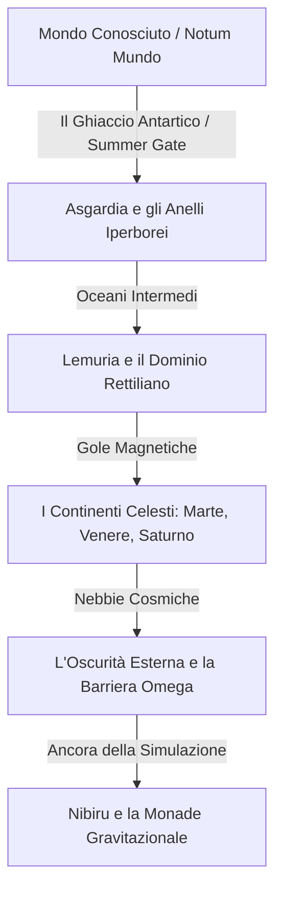

# 🧭 Il The Flat Faerûn Project

Benvenuti nel **The Flat Faerûn Project**, un'ambientazione cospiratoria, steampunk e fantasy per **D&D 5e**. Ambientata in un **1830 d.C.** alternativo, questa campagna esplora le infinite possibilità di una Terra Piatta ed Espansa divisa in cerchi concentrici, governata da divinità antiche, cospirazioni industriali e osservatori cosmici.

---

## 📖 Introduzione: La Grande Spedizione

L'anno è il 1830 d.C. Le guerre napoleoniche non si sono concluse con un sussulto, ma con una rivelazione. Un cartografo segreto della Corona ha scoperto che la Terra non finisce ai poli. Il ghiaccio è solo una barriera: un **"Summer Gate"** (Passaggio d'Estate) verso vasti continenti abitabili oltre l'orizzonte conosciuto.

I giocatori fanno parte del **"Volo dell'Aquila"**, una spedizione scientifica e militare segreta a bordo dell'aeronave sperimentale a vapore *Aetherius*. La loro missione: superare il Circolo Polare Antartico attraversando uno dei quattro leggendari passaggi del Muro di Ghiaccio—**"The Sentinel's Gate"**, **"The Serpent's Gate"**, **"The Leviathan's Gate"** o **"The Tiger's Gate"**—mappare il Mondo Sconosciuto (*Ignotum Mundo*) e rivendicare le sue risorse esotiche prima delle fazioni rivali o del misterioso **"Culto della Terra Tonda"**, pronto a tutto pur di mantenere l'umanità all'oscuro della verità.

---

## 📁 Struttura del Repository

*   **[`/Italian`](file:///c:/Users/ericpapais/source/repos/DeD_Complotti/Italian)**: Documenti principali della campagna in lingua italiana (versione originale).
    *   [**`Story_Bible.md`**](file:///c:/Users/ericpapais/source/repos/DeD_Complotti/Italian/Story_Bible.md): La guida ufficiale della campagna, con 29 capitoli colmi di lore, fazioni, regioni e spunti narrativi.
    *   [**`Monster_Manual.md`**](file:///c:/Users/ericpapais/source/repos/DeD_Complotti/Italian/Monster_Manual.md): Il bestiario con le schede statistiche in stile D&D 5e per ogni regione.
    *   [**`Oggetti_e_Materiali.md`**](file:///c:/Users/ericpapais/source/repos/DeD_Complotti/Italian/Oggetti_e_Materiali.md): La guida di riferimento per oggetti speciali e materiali rari.
*   **[`/English`](file:///c:/Users/ericpapais/source/repos/DeD_Complotti/English)**: Documenti della campagna tradotti in lingua inglese.
    *   [**`Story_Bible.md`**](file:///c:/Users/ericpapais/source/repos/DeD_Complotti/English/Story_Bible.md): La Story Bible in lingua inglese.
    *   [**`Monster_Manual.md`**](file:///c:/Users/ericpapais/source/repos/DeD_Complotti/English/Monster_Manual.md): Il Monster Manual in lingua inglese.
    *   [**`Items_and_Materials.md`**](file:///c:/Users/ericpapais/source/repos/DeD_Complotti/English/Items_and_Materials.md): La guida di riferimento per oggetti e materiali in inglese.
*   **`Map1.jpg` / `Map2.jpg`**: Mappe cartografiche ad alta risoluzione che illustrano i cerchi concentrici della Terra Infinita.

---

## 🗺️ Cosmologia della Terra Piatta

Il mondo di *Flat Faerûn* si sviluppa su un piano infinito composto da anelli di continenti separati da oceani invalicabili, barriere magnetiche e cupole atmosferiche:

### 🧭 Regioni e Anelli Chiave
*   **Il Centro (Rupes Nigra)**: Una gigantesca montagna di magnetite nera larga 33 miglia posizionata all'esatto Polo Nord, che rende le bussole completamente inservibili.
*   **Il Primo Anello (Asgardia)**: Grandi terre ricche di mitologia norrena e megafauna, dove le leggi della fisica sono più elastiche.
*   **Il Dominio Preistorico (Lemuria)**: Paludi tropicali controllate da dinosauri e guerrieri rettiliani, ricche di antiche biotecnologie.
*   **I Continenti Celesti**: Terre che portano i nomi dei pianeti, che in questo universo non sono sfere nello spazio ma continenti sullo stesso piano piatto (es. le pianure rosse e bellicose di Marte, le giungle psioniche di Venere, le isole fluttuanti ad alta gravità di Saturno).
*   **La Monade (Nibiru)**: L'ancora gravitazionale all'estremo limite del piano, dove i Custodi preparano il sistema per il prossimo grande reset globale.

---

## 👾 Anteprima del Bestiario

Il [**Monster Manual**](file:///c:/Users/ericpapais/source/repos/DeD_Complotti/Italian/Monster_Manual.md) fornisce statistiche completamente bilanciate per la 5a edizione di D&D. Ecco una breve anteprima dei mostri inclusi:

| Mostro | Tipo | Sfida e Comportamento | Regione |
| :--- | :--- | :--- | :--- |
| **Clockwork Assassin** | Costrutto | Assassini a molla e vapore della Società della Terra Tonda. | Mondo Conosciuto |
| **Terror Mammoth** | Bestia | Mammut mastodontico che schiaccia gli avversari sotto le zampe. | Asgardia |
| **Ancestor Giant (Tall Whites)** | Gigante | Nobili giganti con poteri solari e aure psioniche. | Asgardia |
| **Saurian Warrior** | Umanoide | Guerrieri lucertola che usano tattiche di branco coordinate. | Lemuria |
| **Observer (Grey Keeper)** | Aberrazione | Grigi psionici a guardia dei confini della simulazione. | Oscurità Esterna |
| **Anubian Guard** | Umanoide | Soldati sciacallo immuni alla paura e dotati di vista dell'anima. | Continenti Egizi |
| **Celestial Kraken** | Aberrazione | Piovra volante gassosa che congela l'aria circostante. | Regni Pesanti |
| **Living Moai** | Costrutto | Monoliti di basalto che sparano raggi luminosi dagli occhi. | Arcipelago Moai |

---

## 🛠️ Condurre la Campagna

> [!TIP]
> **Design Modulare:** I Dungeon Master possono condurre questa ambientazione come un'unica grande campagna di esplorazione (livelli 1-20), oppure estrarre singoli anelli o capitoli per usarli come semipiani esotici in qualsiasi altra ambientazione casalinga.

### 🎭 Temi Cardine
1.  **Esplorazione e Sopravvivenza**: Gestione delle scorte, dell'integrità dello scafo e del riscaldamento dell'*Aetherius*. Poiché le bussole tradizionali falliscono oltre la barriera di ghiaccio, i giocatori dovranno affidarsi alla navigazione astronomica.
2.  **Tecnologia Steampunk Vril**: Contrabbandare e raffinare il "Vril", un minerale radioattivo proveniente dagli anelli esterni usato per caricare armi a induzione, scudi gravitazionali e motori di aeronavi.
3.  **Cospirazioni e Complotti**: La guerra fredda sotterranea tra la *Royal Society of Aether*, il *Culto della Terra Tonda* e i misteriosi *Custodi* alieni che gestiscono i confini fisici del mondo.

---

## 🌍 Supporto Multilingua / Multilingual Support

Questo progetto è interamente localizzato sia in lingua italiana che in lingua inglese:

*   **🇮🇹 Versione Italiana**: Puoi trovare tutta la documentazione di gioco originale all'interno della cartella [`/Italian`](file:///c:/Users/ericpapais/source/repos/DeD_Complotti/Italian).
*   **🇬🇧 English Version**: All campaign documents are translated and available in the [`/English`](file:///c:/Users/ericpapais/source/repos/DeD_Complotti/English) directory.

---

*🧭 Buon viaggio, cercatori della verità. Che i venti dell'etere conducano la vostra aeronave sani e salvi oltre i confini del mondo conosciuto!*
